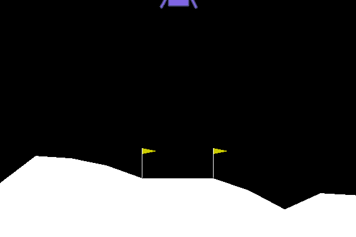

# DRL Project

We implemented all those algorithms to understand DRL and finally implement:

> least squares distributed deep deterministic policy gradient

Run the project:

```python project.py```


## Prerequisites

* python 3.5+
* pytorch 1.3
* tensorboard
* numpy
* gym
* box2d-py
* imageio


## project.py:

In this file every algorithm is called with predefined hyper-parameters.

For example:

```
#Title#
# LS-DDQN

#Code#
### architecture ###
MAIN_HYPERS = {
  "env_name":"LunarLander-v2",
  "optimizer":torch.optim.Adam, "lr":0.001,
  "loss_fn":torch.nn.SmoothL1Loss(),
  "batch":32, "C":100,
  "epsilon_start":1, "epsilon_end":0.05, "epsilon_steps":20000,
  "discount":0.99,
  "h1":128, "h2":256,
  "rb_mem":40000,
  "drl_steps":2000, "srl_steps":20, "regu":1
}

for drl_steps in [5000, 7000]:
  for srl_steps in [20, 50]:
      for regu in [.1, 1, 10, 100]:
        HYPERS = MAIN_HYPERS.copy()
        HYPERS["drl_steps"] = drl_steps
        HYPERS["srl_steps"] = srl_steps
        HYPERS["regu"] = regu
        state_dim, action_dim = PLAYER.env_dimensions(HYPERS["env_name"])
        layers = [state_dim, HYPERS["h1"], HYPERS["h2"], action_dim]
        nn_model = sequential_model(layers,device)
        rb_model = MemQueue(HYPERS["rb_mem"])
        lsddqn = LS_DDQN(state_dim,action_dim,nn_model,rb_model,device,"ls-ddqn")
        # AutoPlayer(lsddqn,HYPERS,REWARD_LOGIC)

PLAYER.add(lsddqn,MAIN_HYPERS,REWARD_LOGIC)
```

This code intializes ls-ddqn and makes grid-search for hyper-parametrs.

The framework provides two ways of running algorithms: AutoPlayer and PLAYER.

* AutoPlayer:

  Run and forget. Runs the algorithm and saves the output to 

  ```./data/**algoritm_name**/**time**__**number**```
  
  Will create a gif of a test run for each training.
  
  Good for running over night.

* PLAYER:

  An interactive way. Asks which algorithm to use, then asks if train or test.

  This is the way to test trained algorithms or train with one set of hyper-parameters.
  
  Saves the data to the same folder as AutoPlayer.

<ins>Configurable parametrs:</ins>

At the begining of projects.py you can set those parameters:

* DEBUG: will save a video of the environment each DEBUG episodes.

* device: which device to use, default: the one available.

* REWARD_LOGIC: the way you want to manipulate the reward you get from the environment, default: return the reward the environment gives


### Framework:

Requires from given algorithm:

* algorithm.name - string

* algorithm.train(reward_logic,env,hypers,writer) - method

  > reward_logic - how to manipulate the reward you get from the envirment
  > 
  > env - gym environment
  >
  > hypers - dict of parameters
  >
  > writer - tensorboard SummaryWriter

* algorithm.save_nn_params(files_path) - method

  > files_path - string of folder to save weights

* algorithm.load_nn_params(files_path) - method

  > files_path - string of folder to load weights

* algorithm.test(gym.make(env_name)) - method

  > gym.make(env_name) - gym environment
  >
  > should return list of frames of the environment (to create gif of the test)


### Algorithms:

We've implemented DQN, DDQN, CDQN, LS-DDQN, DDPG, DDDPG, LS-DDDPG.

If you want to add an algorithm just make a .py file with the stuff the framework (listed above) needs and put it in algorithms folder.

Don't forget to import in project.py.


### Models:

Neural Nets, Replay buffers, noise processes is included.

You can add other, don't forget to import in project.py.


## py2nb.py

Converts .py to .ipynb, run ```./py2nb.py -h``` for info.


## Results


### DQN




### DDQN


### CDQN


### LS-DDQN


### DDPG


### DDDPG


### LS-DDDPG


## Papers

* [DQN](https://deepmind.com/research/publications/human-level-control-through-deep-reinforcement-learning/)
* [DDQN](https://arxiv.org/abs/1509.06461)
* [LS-DDQN](https://arxiv.org/abs/1705.07461)
* [CDQN](https://arxiv.org/abs/1707.06887)
* [DDPG](https://arxiv.org/abs/1509.02971)
* [LS-DDPG](https://github.com/taldatech/pytorch-ls-ddpg)


## Miscellaneous

* [how to write README.md](https://gist.github.com/PurpleBooth/109311bb0361f32d87a2)
